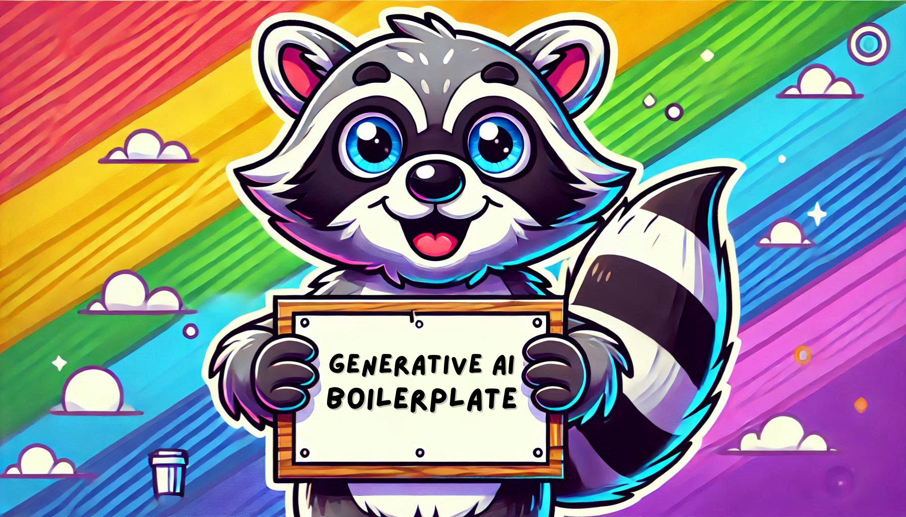

# Welcome to the Generative AI Boilerplate! ✨

This boilerplate is designed to support the practical implementation of concepts from the LLMs and Generative AI workshop. It provides a foundation to integrate with Amazon Bedrock and Google AI Studio and build custom solutions.

### About Generative AI and LLMs

Generative AI refers to a branch of artificial intelligence that focuses on creating new content, whether it be text, images, audio, or even code. This capability is powered by Large Language Models (LLMs) — massive machine learning models trained on extensive datasets to understand and generate human-like language. These models enable a variety of applications, such as automated content creation, chatbots, language translation, summarization, and more.

### What is Amazon Bedrock?

It is a service offered by AWS that allows you to build and scale applications powered by Generative AI without the need to manage underlying infrastructure. It provides access to foundation models from several AI providers, enabling developers to use pre-trained models or fine-tune them according to specific needs.

In order to use this service, you need to [create a free account](https://aws.amazon.com/free).

### What is Google AI Studio?

It is Google's platform for developing, training, and deploying AI models, including LLMs and generative AI systems. It offers a user-friendly interface for experimenting with AI capabilities and integrates seamlessly with Google Cloud's infrastructure. Developers can use it to fine-tune pre-trained models or create custom workflows.

If you have a Gmail account, you can already use the service. If you don’t have one yet, [create one here](https://gmail.com).

## Getting Started

1. Clone the project.
2. Run the command `make start_aws` or `make start_google` and follow the instructions regarding the virtual environment.

If you chose AWS, follow these instructions:

3. In **.env**, fill in `AWS_ACCESS_KEY_ID` and `AWS_SECRET_ACCESS_KEY`.
4. In **config.py**, fill in `AWS_MODEL_ID`.

If you chose Google, follow these instructions:

3. In **.env**, fill in `GEMINI_API_KEY`.
4. In **config.py**, fill in `MODEL_NAME`.

You can now update **main.py** as you wish!

## Prompt Manager

It helps you organize and manage your prompts as text files, stored in the `src/prompt` folder. This allows you to keep your prompts separate from your code, making them easy to modify and extend. The `PromptManager` class can dynamically generate prompts by reading from the files and replacing placeholders with the provided variables.

### How to Use the PromptManager class

1. **Create prompt files:** Add your prompts as .txt files in the `src/prompt` directory. Each file should contain a template for a prompt with placeholders that can be replaced at runtime.

2. **Define placeholders in your prompts:** You can define placeholders in the prompt text by using curly braces {}. These placeholders will be replaced with specific values when you generate the prompt.

### Example

`persona.txt`: This prompt defines the persona that the model should assume. The placeholders {role}, {expertise}, and {request} will be replaced dynamically.

- **File Location:** src/prompt/persona.txt
- **Name of the prompt:** persona
- **Content:** You are a {role} with experience in {expertise}. {request}

You can create as many prompts you want!

### Usage

```python
# Import the PromptManager class
from prompt_manager import PromptManager

# Initialize the PromptManager with the directory where your prompt files are stored
prompt_manager = PromptManager('src/prompt')

# Generate a prompt for the persona with specific values for role, expertise, and request
prompt = prompt_manager.generate_prompt(
    "persona", 
    role="software engineer", 
    expertise="backend development", 
    request="Explain how to implement a RESTful API."
)

# The prompt variable now contains the formatted prompt as a string
print(prompt)
```
